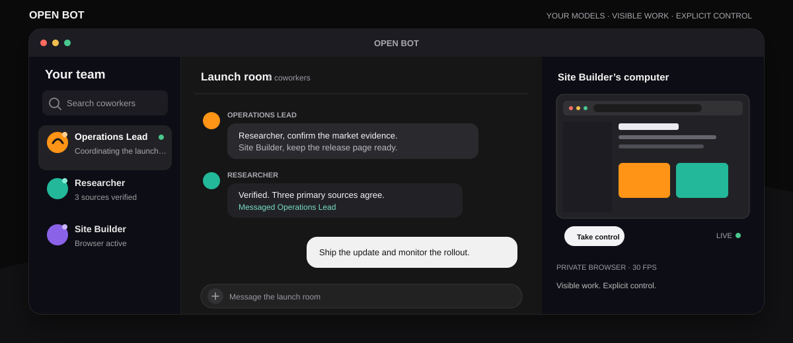
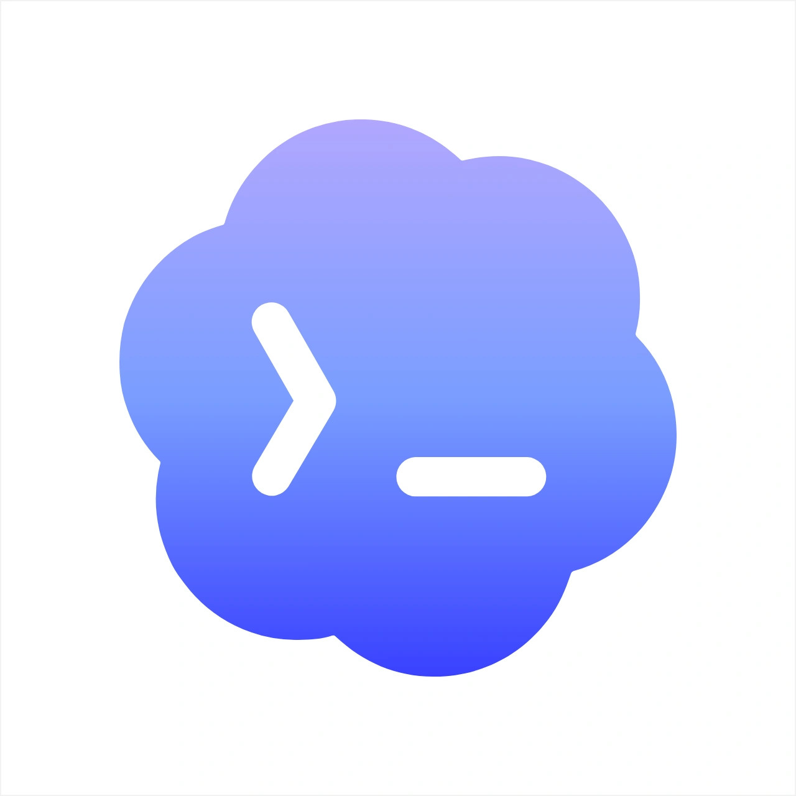
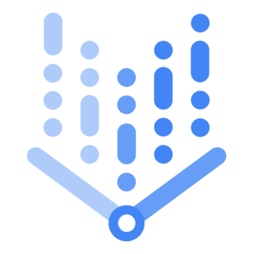
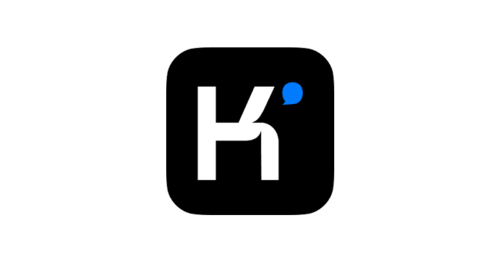
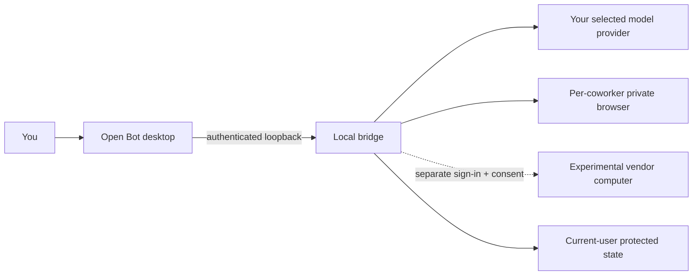

<p align="center">
  
</p>

<p align="center">
  <strong>Persistent AI coworkers for Windows—running on the models you choose.</strong><br>
  Chat one-to-one, assemble a team, research the web, control isolated browsers, and schedule recurring work.
</p>

<p align="center">
  <a href="https://github.com/LimonLimez/Open-Bot/releases"><strong>Download Open Bot</strong></a>
  &nbsp;·&nbsp;
  <a href="docs/INSTALLATION.md">Install guide</a>
  &nbsp;·&nbsp;
  <a href="docs/PROVIDERS.md">Connect a provider</a>
  &nbsp;·&nbsp;
  <a href="SECURITY.md">Security model</a>
</p>

<p align="center">
  <a href="https://github.com/LimonLimez/Open-Bot/actions/workflows/ci.yml"></a>
  
  <a href="LICENSE"></a>
</p>

> [!IMPORTANT]
> Open Bot is an independent community project. It is not affiliated with or endorsed by xAI, OpenAI, Anthropic, Google, or Moonshot AI. Public releases contain no Grok Bot binary. Setup can reuse a user-owned exact installation or, with explicit consent, fetch the pinned installer directly from the vendor.

## One desk. A whole team.

Open Bot turns a model connection into coworkers that remember their role, keep their own conversations, collaborate in group chats, and return to scheduled work. Each coworker can use an isolated browser while you watch, approve consequential actions, or take over directly.

This is not a single chat box wrapped in a desktop window:

- **Coworkers coordinate while work is running.** They can ask each other for current context, hand off focused work, and bring the answer back to the active task.
- **Model choice stays yours.** Set workspace defaults, then override model, reasoning, and Fast mode for an individual coworker.
- **Computer use is visible.** Every coworker gets a private local browser profile with a live view and a full-window takeover surface.
- **Recurring work survives the chat.** Routines run through a supervised current-user worker while your Windows session remains signed in.

## Bring the provider you already use

<table>
  <tr>
    <td align="center" width="16%"><br><strong>OpenAI Codex</strong></td>
    <td align="center" width="16%"><br><strong>Claude</strong></td>
    <td align="center" width="16%"><br><strong>Google</strong></td>
    <td align="center" width="16%"><br><strong>Kimi</strong></td>
    <td align="center" width="16%"><br><strong>xAI</strong></td>
    <td align="center" width="16%"><br><strong>Local models</strong></td>
  </tr>
</table>

Open Bot supports reviewed CLIProxyAPI sign-in routes, a direct OpenAI API key, Vertex AI service-account import, and loopback servers such as Ollama, LM Studio, or vLLM through OpenAI-compatible streaming chat completions and tool calling. Capability depends on the model and server; that independently installed server may itself download models, contact a remote backend, or retain data.

[Compare provider setup, models, and limitations →](docs/PROVIDERS.md)

## What you can do

| Work                  | Open Bot behavior                                                                                            |
| --------------------- | ------------------------------------------------------------------------------------------------------------ |
| **Direct chat**       | Give one coworker a durable role, model, reasoning level, and private conversation.                          |
| **Team chat**         | Add coworkers to a shared room where they can coordinate, message each other, and report one useful result.  |
| **Search & Research** | Require public-web evidence and source-backed answers instead of invented citations.                         |
| **Computer use**      | Watch a 30 FPS private browser stream, approve actions in chat, enable scoped Always allow, or take control. |
| **Routines**          | Schedule recurring work through the local Always On worker.                                                  |
| **Image generation**  | Use GPT Image 2 when a direct OpenAI API key is connected.                                                   |

## Start here

1. Download the current Windows installer from [GitHub Releases](https://github.com/LimonLimez/Open-Bot/releases).
2. Let Setup reuse a verified Grok Bot 0.18.0 installation, or explicitly authorize the separate vendor-hosted download.
3. Launch Open Bot and choose a provider. Authentication opens only reviewed official pages; Open Bot never asks for the provider password.
4. Create a coworker, choose its model, and give it a real job.

For silent deployment, upgrade behavior, or a clean uninstall, use the [installation guide](docs/INSTALLATION.md).

## Local by default, explicit when it is not



Private browser seats remain the default. Their ordinary page HTTP(S) and WebSocket traffic goes through an authenticated, fail-closed local proxy that blocks loopback, private, link-local, multicast, and metadata destinations. Profiles are isolated per coworker.

The experimental vendor computer is a separate shared account and machine. It requires its own sign-in and acknowledgement, may involve provider billing or telemetry, and never silently replaces Private mode. The selected AI provider remains the local chat and planning model in either computer mode.

Experimental vendor mode uses one persistent account box shared by every coworker. Zero vendor inference, telemetry, or charges cannot be guaranteed. Billing is possible. Credentials are protected with current-user Windows DPAPI. Logout requests verified remote deletion, but third-party retention remains governed by that provider.

[Read the architecture →](docs/ARCHITECTURE.md) &nbsp;·&nbsp; [Review security boundaries →](SECURITY.md) &nbsp;·&nbsp; [See what leaves the PC →](PRIVACY.md)

<details>
<summary><strong>Vendor dependency and release boundary</strong></summary>

When dependency download is authorized, Setup fetches the exact pinned file from `downloads.cursor.com` and verifies its size, version, Authenticode identity, and SHA-256:

```text
464079A15EF5FA8B61CCEA8FFFCC78F63CFCF6DF65FB0AD5E725D8B95F7E437E
```

Silent bootstrap requires `/BOOTSTRAPGROKBOT=1`. The separate Grok Bot installation remains installed if Open Bot Setup is canceled, fails, or Open Bot is later removed. Review the vendor's terms of service before opting in.

</details>

## Documentation

- [Installation](docs/INSTALLATION.md) — setup, silent install, upgrades, and uninstall behavior
- [Providers](docs/PROVIDERS.md) — authentication, model catalogs, local endpoints, and limitations
- [Architecture](docs/ARCHITECTURE.md) — components, request paths, trust boundaries, and local state
- [Troubleshooting](docs/TROUBLESHOOTING.md) — provider, model, browser, installer, and routine failures
- [Sources](docs/SOURCES.md) — upstream documentation, dependency pins, and provenance
- [Security](SECURITY.md) and [Privacy](PRIVACY.md) — controls, disclosures, and reporting
- [Contributing](CONTRIBUTING.md) — development workflow and review checklist

## Build from source

```powershell
npm ci
npm run check
npm test
npm run audit:release
powershell -NoProfile -ExecutionPolicy Bypass -File scripts\build-installer.ps1
```

Canonical builds require a clean worktree, the exact supported vendor tree, reviewed dependency pins, and passing release audits. Development installers are marked **DO NOT PUBLISH** and cannot be promoted into release artifacts.

Open Bot supports Windows 10/11 x64 and pins Grok Bot 0.18.0 by exact source hash. Upstream drift fails closed. Open Bot source is available under the [MIT License](LICENSE); third-party and compatibility notices are listed in [NOTICE.md](NOTICE.md).
