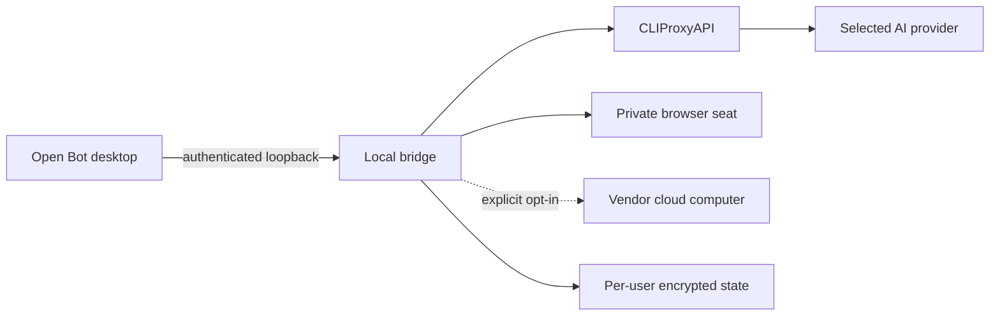

<p align="center"></p>

<p align="center">
  <a href="https://github.com/LimonLimez/Open-Bot/releases"></a>
  <a href="https://github.com/LimonLimez/Open-Bot/actions/workflows/ci.yml"></a>
  
  <a href="LICENSE"></a>
</p>

<p align="center"><strong>A local-first, always-on digital-coworker app powered by the AI provider you choose.</strong></p>

<p align="center"><a href="#quick-start">Quick start</a> · <a href="docs/PROVIDERS.md">Providers</a> · <a href="docs/ARCHITECTURE.md">Architecture</a> · <a href="docs/TROUBLESHOOTING.md">Troubleshooting</a> · <a href="SECURITY.md">Security</a></p>

> [!IMPORTANT]
> Open Bot is an independent community project. It is not affiliated with or endorsed by xAI, OpenAI, Anthropic, Google, or Moonshot AI. Public releases contain no Grok Bot binary; Setup can reuse a user-owned exact installation or, with explicit consent, fetch the pinned installer directly from the vendor.

## Why Open Bot

Open Bot keeps the collaborative desktop experience—coworkers, conversations, routines, and live computer previews—while replacing model routing and computer controls with reviewed local components.

| Capability              | What you get                                                                                                    |
| ----------------------- | --------------------------------------------------------------------------------------------------------------- |
| Bring your model        | OpenAI Codex, Claude, Google, Kimi, xAI, Vertex AI, a direct OpenAI key, or a loopback OpenAI-compatible server |
| Real coworkers          | Persistent agents, group conversations, handoffs, schedules, Search, and Research                               |
| Private by default      | Isolated local browser profiles and loopback-only authenticated services                                        |
| Deliberate cloud access | Experimental vendor computer is separate, opt-in, approval-gated, and clearly labeled                           |
| Per-agent control       | Workspace defaults plus agent-specific model, reasoning, and Fast-mode overrides                                |
| Durable operation       | Background routines while the Windows user remains signed in and the PC stays awake                             |

## Supported providers

<table><tr>
<td align="center"><br><b>OpenAI Codex</b></td>
<td align="center"><br><b>Claude</b></td>
<td align="center"><br><b>Google</b></td>
<td align="center"><br><b>Kimi</b></td>
<td align="center"><br><b>xAI</b></td>
<td align="center"><br><b>Local models</b></td>
</tr></table>

See [Provider setup and capabilities](docs/PROVIDERS.md) for connection methods, limitations, and upstream documentation.

Local routes support Ollama, LM Studio, or vLLM through OpenAI-compatible streaming chat completions and tool calling. Capability depends on the model and server; that independently installed server may itself download models, contact a remote backend, or retain data.

## Quick start

1. Download the latest installer from [GitHub Releases](https://github.com/LimonLimez/Open-Bot/releases).
2. Let Setup reuse a verified Grok Bot 0.18.0 tree, or explicitly authorize the separate vendor-hosted download.
3. Launch Open Bot and connect a provider from Settings.
4. Choose a workspace model and reasoning level; override either per coworker when useful.

The app never asks for a provider password. OAuth and device flows open only reviewed official authorization pages. Read the [installation guide](docs/INSTALLATION.md) before silent deployment or source builds.

## How it fits together



Private browser seats are isolated per coworker. Ordinary page HTTP(S) and WebSocket traffic is routed through a fail-closed local proxy that blocks loopback, private, link-local, multicast, and metadata destinations. Vendor computer use is a separate shared account and box; it never silently replaces Private mode. Details: [Architecture](docs/ARCHITECTURE.md), [Security](SECURITY.md), and [Privacy](PRIVACY.md).

### Release boundaries

Private browser seats remain the default. Experimental vendor mode uses one persistent account box shared by every coworker and requires separate sign-in and acknowledgement. Zero vendor inference, telemetry, or charges cannot be guaranteed. Billing is possible. Credentials are protected with current-user Windows DPAPI; logout requests verified remote deletion, but third-party retention remains governed by that provider.

The selected AI provider remains the local chat and planning model even while the experimental vendor computer is active.

When dependency download is authorized, Setup fetches the exact pinned file from `downloads.cursor.com`: SHA-256 `464079A15EF5FA8B61CCEA8FFFCC78F63CFCF6DF65FB0AD5E725D8B95F7E437E`. Silent bootstrap requires `/BOOTSTRAPGROKBOT=1`. The separate Grok Bot installation remains installed if Open Bot Setup is canceled, fails, or Open Bot is later removed. Review the vendor's terms of service before opting in.

## Product highlights

- **Chat, Search, and Research** modes with citations and multi-source workflows.
- **Persistent group conversations** where coworkers can coordinate and hand off work.
- **Computer use** with inline approvals, provider-scoped Always allow, and a full-window takeover surface.
- **Local models** through Ollama, LM Studio, vLLM, and other loopback OpenAI-compatible servers.
- **GPT Image 2** generation when a direct OpenAI API key is connected.
- **Routines** that keep recurring work moving in the background.

## Documentation

| Guide                                      | Purpose                                                             |
| ------------------------------------------ | ------------------------------------------------------------------- |
| [Installation](docs/INSTALLATION.md)       | Interactive setup, silent setup, upgrades, and uninstall behavior   |
| [Providers](docs/PROVIDERS.md)             | Authentication, model catalogs, local endpoints, and limitations    |
| [Architecture](docs/ARCHITECTURE.md)       | Components, trust boundaries, request paths, and local state        |
| [Troubleshooting](docs/TROUBLESHOOTING.md) | Sign-in, model, browser, installer, and routine failures            |
| [Sources](docs/SOURCES.md)                 | Primary upstream documentation, pinned dependencies, and provenance |
| [Security](SECURITY.md)                    | Threat boundary, computer controls, reporting, and release policy   |
| [Privacy](PRIVACY.md)                      | What stays local and when third-party services receive data         |
| [Contributing](CONTRIBUTING.md)            | Development workflow and review checklist                           |

## Build from source

```powershell
npm ci
npm run check
npm test
npm run audit:release
powershell -NoProfile -ExecutionPolicy Bypass -File scripts\build-installer.ps1
```

Canonical builds require a clean worktree, the exact supported vendor tree, reviewed dependency pins, and passing release audits. Development installers are marked **DO NOT PUBLISH** and cannot be promoted into release artifacts.

## Project status

Open Bot supports Windows 10/11 x64 and pins Grok Bot 0.18.0 by exact source hash. Upstream drift fails closed. The experimental vendor computer may involve separate availability, terms, telemetry, or billing from its provider.

Open Bot source is available under the [MIT License](LICENSE). Third-party and compatibility notices are listed in [NOTICE.md](NOTICE.md).
