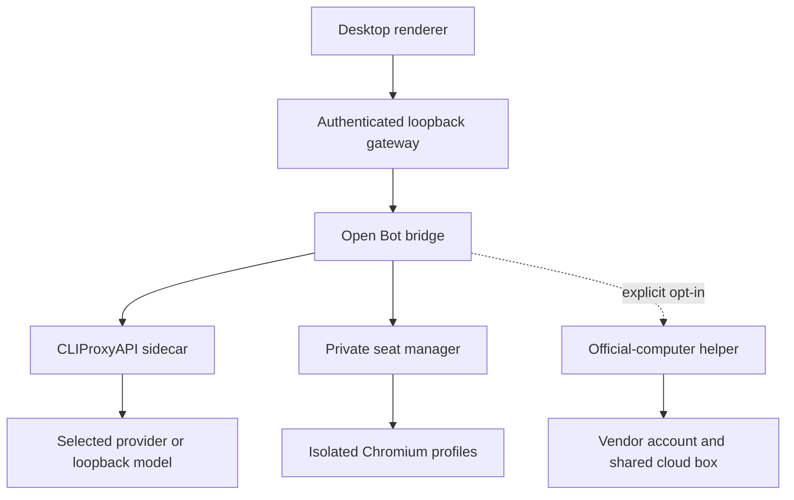

# Architecture

Open Bot is a patched desktop shell around a reviewed local control plane. The vendor application is copied only from an exact verified Grok Bot 0.18.0 tree; the public repository and release wrapper contain no vendor binary.

## Request paths

1. The renderer sends an authenticated request to the loopback gateway.
2. The bridge captures the coworker identity and selected settings.
3. Model requests go only to the selected route. Unknown or failed routes stop; they do not fall back.
4. Tool events return through the bridge and are checked against the active computer provider, control lease, approval policy, and current seat.

## Computer providers

**Private** is the default. Each coworker receives a persistent, isolated browser profile. Page traffic crosses a per-seat authenticated proxy with DNS and address-class filtering. Browser state survives restarts; profiles are not shared across coworkers.

**Vendor cloud** is experimental and separate. It requires its own Cursor sign-in, an explicit billing/telemetry acknowledgement, and a deliberate mode change. Action approvals bind the displayed frame and action; takeover pauses agent input. Provider-scoped Always allow bypasses only the prompt, not session, generation, deadline, stale-frame, or takeover checks.

## Local state

Runtime state lives under the current user's Local AppData, separate from the installation. It includes conversations, provider configuration, schedules, browser profiles, and encrypted official-computer state. Uninstall can preserve this data for upgrades or remove it for a fresh start.

## Trust boundaries

- All product listeners bind to loopback and require generated credentials.
- Helper processes receive only the minimum state and capability needed for their role.
- Private browsing blocks local-network and metadata targets at the application proxy boundary.
- Provider services still receive prompts and may apply their own retention, telemetry, terms, and billing.
- Browser containment is application-layer hardening, not a Windows network namespace or firewall guarantee.

For the full boundary and reporting process, read [Security](../SECURITY.md).
